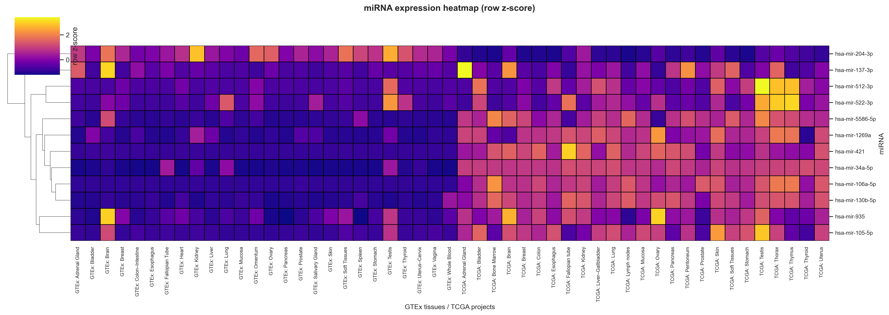
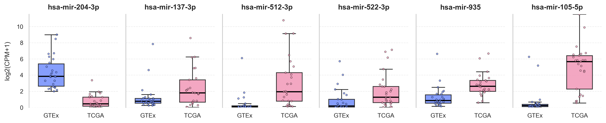
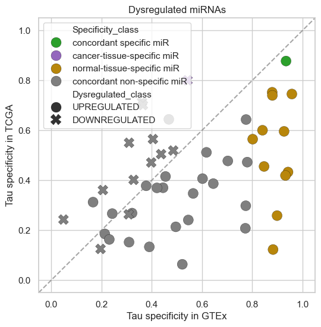

# Pan-Cancer Remodeling of Tissue-Specific microRNA Expression and Dysregulation

MicroRNAs are frequently dysregulated in cancer, yet how their tissue-specificity is remodeled during malignant transformation remains poorly characterized. Here we systematically quantified the tissue-specificity of miRNAs across normal (GTEx) and tumor (TCGA) tissues using the Tau index, and compared its distribution between healthy and cancerous states. To robustly define dysregulation, we combined two independent analyses: a binomial test over per-project differential expression across 17 matched normal tissues within TCGA cohort, and a TCGA–GTEx pan-tissue comparison of mean expression. The change in specificity (ΔTau) separated up- from down-regulated miRNAs, showing moderate agreement with the binomial signal and a strong correlation with the expression-based contrast. Finally, we identified 6 miRNAs that lose tissue-specificity upon transformation while remaining consistently upregulated (miR-519a-5p, miR-512-3p, miR-522-3p, miR-105-5p, miR-935, miR-1269a). Functional analysis of experimentally validated targets showed significant enrichment for converging on core oncogenic programs for miR-512-3p, miR-105-5p and miR-935, such as apoptosis and cellular-stress regulation, TP53, FoxO, PI3K–Akt/mTOR signaling, immune modulation. Collectively, integrating specificity dynamics with dysregulation evidence pinpoints candidate miRNAs with coordinated, cancer-relevant regulatory roles and highlights those with favorable tissue specificity profiles for therapeutic targeting.

---

## Repository Structure

| File | Description |
|------|-------------|
| `TCGA.ipynb` | Notebook with TCGA dataset processing: Tau specificity assessment, DE analysis (cancer-vs-normal) and finally binomial test implementation |
| `GTEx.ipynb` | Notebook with Tau specificity assessment within GTEx dataset (normal tissues) |
| `TCGA_GTEx.ipynb` | Integration TCGA and GTEx data |
| `constants.py` | All constants | 
| `functions.py` | Data loading and processing functions | 
| `auxillary_plots.py` | Plotting functions | 
| `enrichment_analysis.py` | API for StringDB enrichment analysis | 
| `/figures` | output figures (not all) | 
| `/tables` | output tables | 
| `/targets` | selected targets from miRTarBase to run enrichment analysis | 
| `Interactive_tau_scatter.html` | Interactive map with all integrated results | 

---

---

## Contact
Work email: amismailov@hse.ru
Personal email: neuro.promotion@gmail.com 

---
